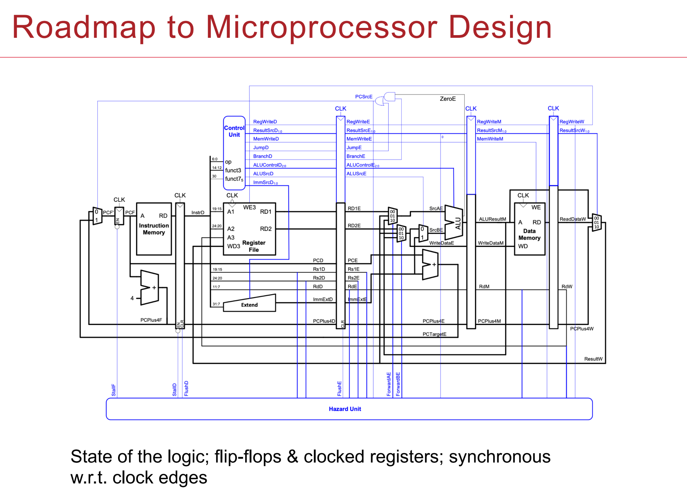

# Computer-Hardware-Design

This project is about implementing a soft-core RISC-V CPU with System Verilog.

Lab9 includes all final data.

The image below is the high level architechre of the system.

